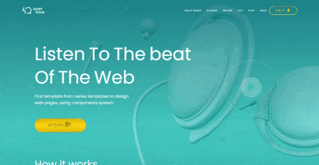

<h1><a href="https://overlove.netlify.app">Overlove Landing Page</a></h1>
 

## О проекте

**Лендинг "Overlove"** - это проект, представляющий собой динамическую лендинг-страницу с анимациями. В проекте
используются различные библиотеки NPM, бургер-меню, CSS-анимации, объектно-ориентированное программирование и классы
JavaScript. Код проекта придерживается единого стиля кодирования.

## Зависимости проекта

* <a href='https://www.npmjs.com/package/@glidejs/glide'>glide</a>
* <a href='https://www.npmjs.com/package/animate.css?activeTab=versions'>animate.css</a>
* <a href='https://www.npmjs.com/package/hamburgers'>Hamburgers</a>
* <a href='https://www.npmjs.com/package/wowjs'>wowjs</a>

## Лицензия

Распространяется под лицензией MIT. Дополнительные сведения см. в
файле [LICENSE](https://github.com/kluevevga/Overlove/blob/master/LICENSE).